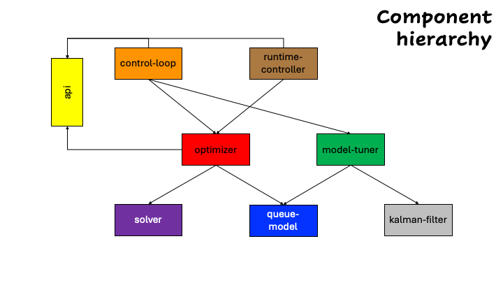

# Globally optimized accelerator assignment and scaling with service objectives

This organization comprises the components that make up control and optimization machinery for the operational global optimization of an LLM inferencing platform, including the assignment of heterogeneous accelerators to multiple inference servers, each serving an LLM model, subjected to multiple classes of service. Also, decisions on the number of replicas and maximum batch size for the deployed inference servers are made.

The high-level component structure is depicted below.

- **Optimization**: At the core, there is an *optimizer* which solves a global optimization problem with a given objective and SLO contraints for the various classes of service. The *optimizer* produces the various decision variables using one of several *solvers*, in a pluggable way.

- **Performance modeling**: In its optimization loop, the *optimizer* uses a *queue-model* which relates performance metrics of a given server, such as request queueing time and inter-token latency, to server and load characteristics, such as accelerator type, number of replicas, and maximum batch size, on one hand, and workload statistics, such as request rates and lengths in tokens, on the other. There should be several queueing models, varying in complexity and accuracy, provided in a pluggable way. A *queue-model* has its own internal parameters which may be set through profiling/benchmarking and/or dynamically, learning from observations through a *model-tuner*, which uses an extended *kalman-filter*.

- **Control**: There are two ways to run the optimization in an LLM inferencing platform.

  - *control-loop*: The control loop comprises: (1) a Collector to get data about the inference servers through Prometheus and server deployments, (2) an Optimizer to make decisions, (3) an Actuator to realize such decisions by updating server deployments, and (4) a periodic Controller that has access to static and dynamic data. The control loop may run either externally or in a Kubernetes cluster.

  - *runtime-controller*: Running in a Kubernetes cluster and using custom resources and a Kubernetes runtime controller, the optimizer may be excercised in reconciliation to updates to an Optimizer custom resource.

- **Interfaces**: All interfaces are defined, including json specifications, in an *api* component.

Each of the repositories host a component. Currently, we have a few issues to be rectified.

- The *optimizer* and *control-loop* components are in the same inferno repository.
- Some interfaces are defined in the inferno repository, instead of using the api repository directly.
- The *control-loop* does not employ the *model-tuner*.
- Solvers and queueing models are not pluggable.
- There is a need for additional components, such as prediction and stability control.
